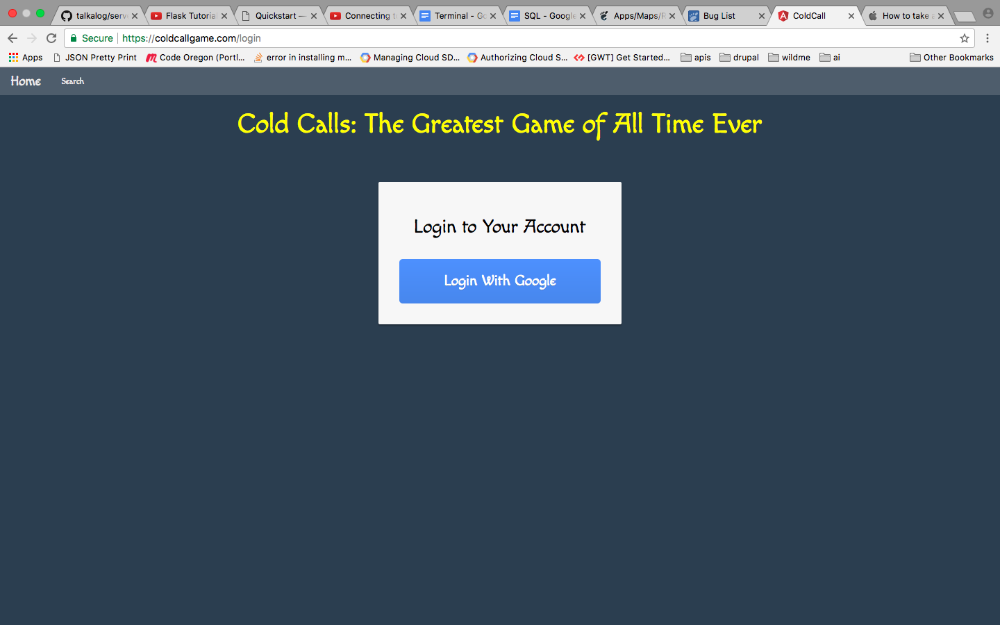
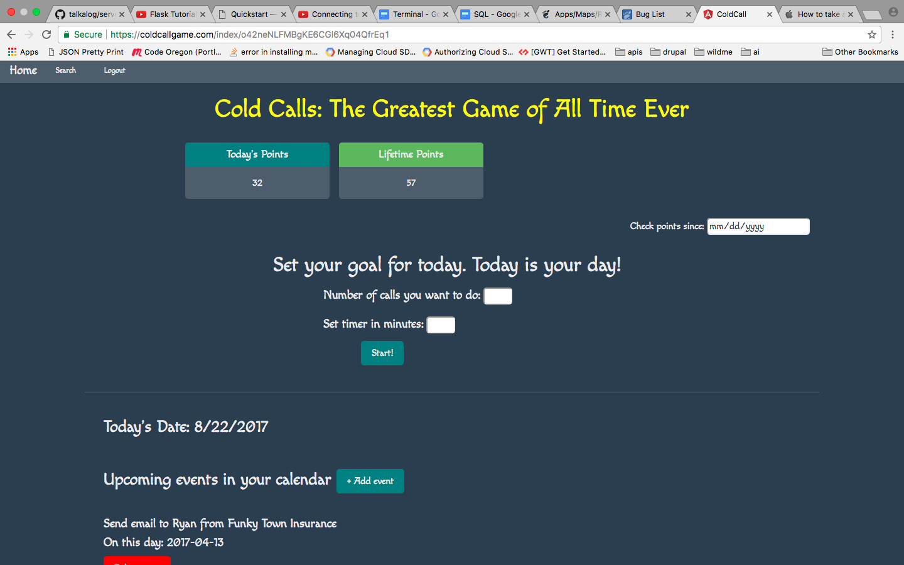
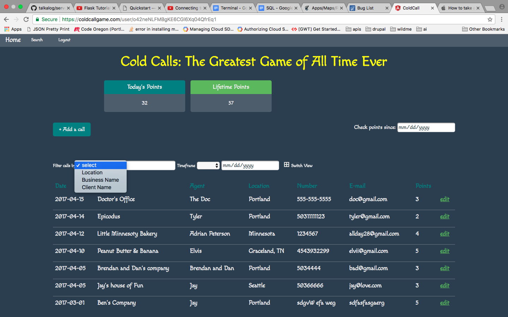
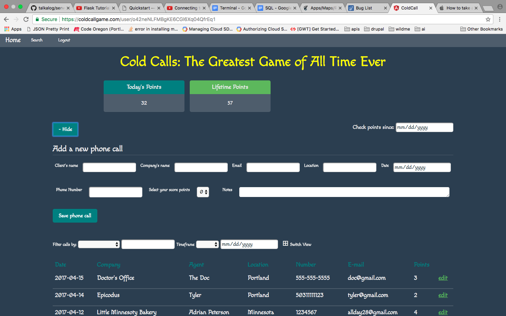

# Cold Call: The Greatest Game of All Time Ever
https://coldcallgame.com/
This project was generated with [Angular CLI](https://github.com/angular/angular-cli) version 1.0.0.

## Description
Cold Call Game was inspired by my friends who work as brokers/underwriters. They need to make cold calls in order to get new agents and accounts, but constantly get discourage whenever they get a rejection . This web app is a CRM that motivates the user to make cold calls because it is a fun, not a tedious, process. Every call, depending of its results, is a number of points. Every 70 points the boss takes you out for lunch!

## Notes
This app is built with Angular 2, using Firebase, but it can also be seen built with Drupal! [Check out my other version of Cold Call.](https://github.com/uturunku1/drupal-cold-call)

## Images

## Installation

* `git clone <repository-url>`
* `cd team-manager`
* `npm install`
* `bower install`

## Development server

Run `ng serve` for a dev server. Navigate to `http://localhost:4200/`. The app will automatically reload if you change any of the source files.

## Code scaffolding

Run `ng generate component component-name` to generate a new component. You can also use `ng generate directive/pipe/service/class/module`.

## Build

Run `ng build` to build the project. The build artifacts will be stored in the `dist/` directory. Use the `-prod` flag for a production build.

## Planning

* Access a list of the cold calls I have made for my sales.
* Filter/organize these phone calls based on the date(month) or the city/town client is located.
* Search for the name of client/person to, for instance, find out if I have called that person in the past or find out how the call went.
* Search for the name of client/person to, for instance, find out if I have called that person in the past or find out how the call went.
* Check on the details of a phone call: the name of the agency or agent, their phone numbers, a description of the result of the conversation (for example, folllow-up call, a call that got me an appointment, call with no answer, etc.), the date of the conversation, the city/place client is located and the number of points I scored with this cold call.
* Log in a new cold call with the details and assign it a number of points (for my points rewards system).
* Alert/reminder of the follow-up calls I must make that day.
* Check how many points I have gotten so far.

## Further help

To get more help on the Angular CLI use `ng help` or go check out the [Angular CLI README](https://github.com/angular/angular-cli/blob/master/README.md).
